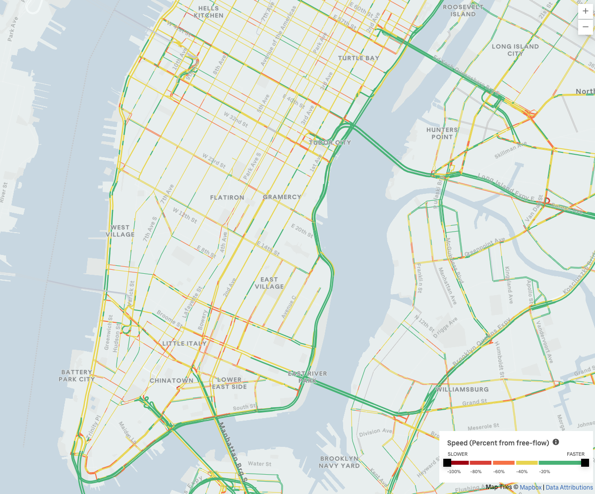
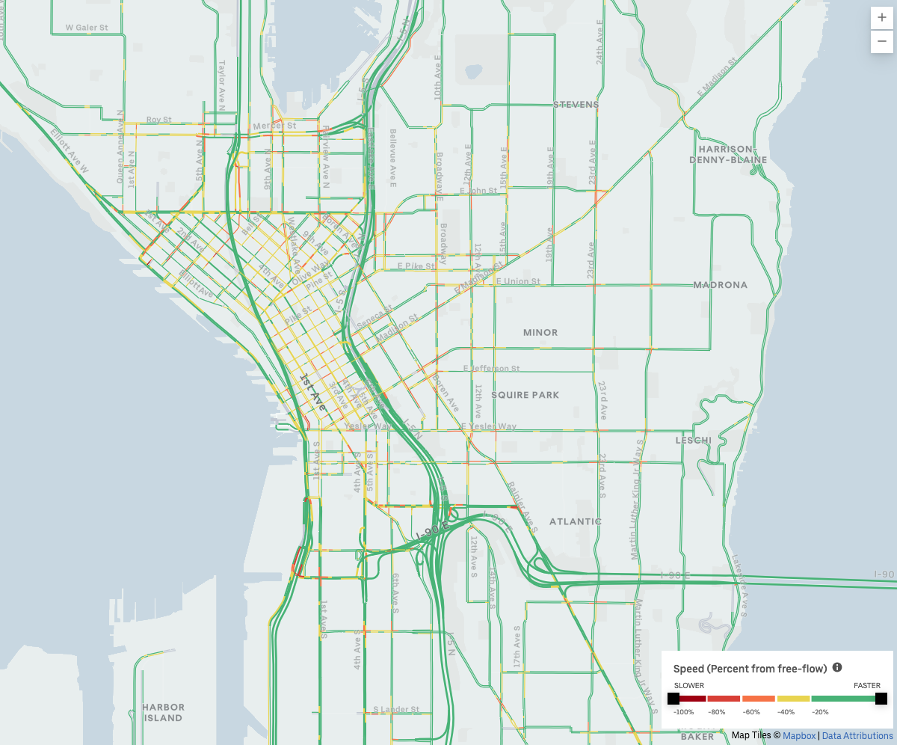
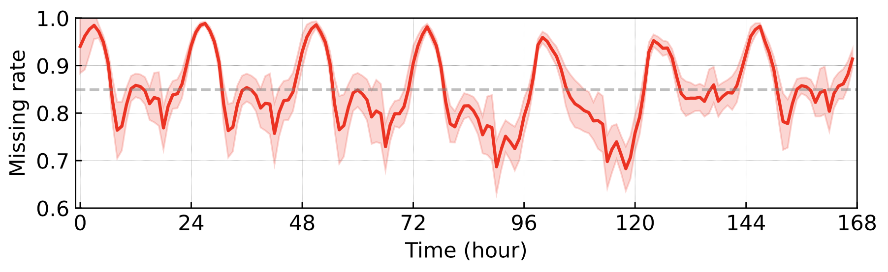
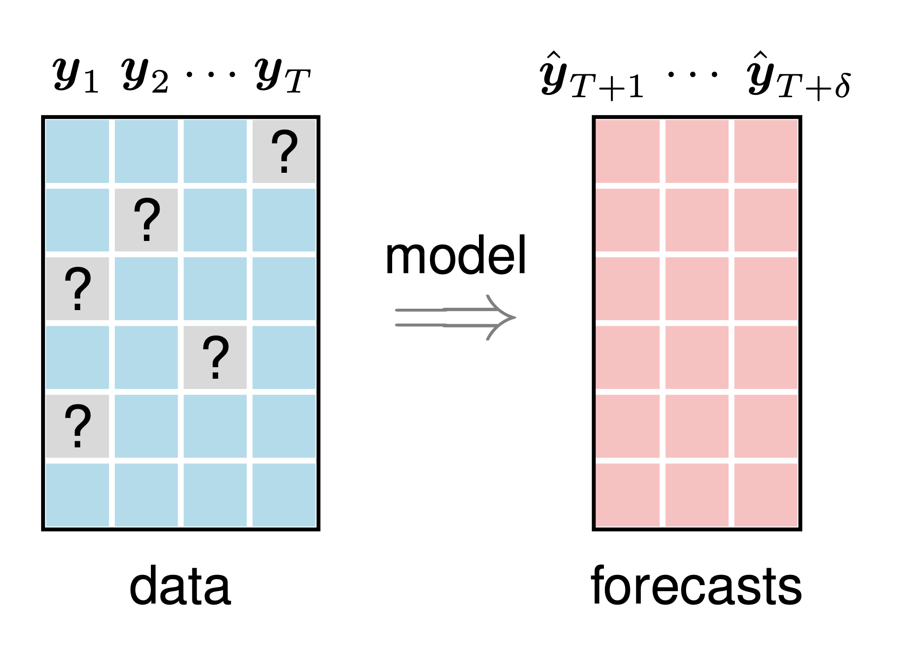

# tracebase
[](https://opensource.org/licenses/MIT)

[](https://github.com/xinychen/tracebase/archive/master.zip)
[](https://github.com/xinychen/tracebase)

<h6 align="center">Made by Xinyu Chen • :globe_with_meridians: <a href="https://xinychen.github.io">https://xinychen.github.io</a></h6>

[Uber movement project](https://movement.uber.com/) provides data and tools for cities to more deeply understand and address urban transportation problems and challenges. Uber movement speed data measure hourly street speeds across a city (e.g., [New York City](https://movement.uber.com/explore/new_york/speeds), [Seattle](https://movement.uber.com/explore/seattle/speeds), and [London](https://movement.uber.com/explore/london/speeds)) to enable data-driven city planning and decision making. These data are indeed multivariate time series with N road segments and T time steps (hours), and are featured as high-dimensional, sparse, and nonstationary. To overcome the challenge created by these complicated data behaviors, we propose a temporal matrix factorization framework for multivariate time series forecasting on high-dimensional and sparse Uber movement speed data.

<br>

## Data Processing

> A detailed introduction to the [analysis of missing data problem in Uber movement speed data](https://medium.com/p/208d7a126af5) is available on Medium.

### Download Movement Speed Data

1. Open the download page of Uber movement project. Take an example of New York City, please try to open [NYC Uber movement speed data](https://movement.uber.com/explore/new_york/speeds).
2. Set the product as `speeds` and one specific time period.
3. Download data and save it on your computer.

<br>

<p align="center">
<a href="https://movement.uber.com/explore/new_york/speeds">

</a>
<a href="https://movement.uber.com/explore/seattle/speeds">

</a>
</p>

<p align="center"><b>Figure 1</b>: Uber movement speed heatmaps of New York City (left panel) and Seattle (right panel), USA.</p>

### Extract Road Segments

Please download `movement-speeds-hourly-new-york-2019-1.csv` (movement speed data file of New York City in January 2019).

```python
import pandas as pd
import numpy as np

data = pd.read_csv('movement-speeds-hourly-new-york-2019-1.csv')
road = data.drop_duplicates(['osm_way_id', 'osm_start_node_id', 'osm_end_node_id'])
road = road.drop(['year', 'month', 'day', 'hour', 'utc_timestamp', 'segment_id', 'start_junction_id', 
                  'end_junction_id', 'speed_mph_mean', 'speed_mph_stddev'], axis = 1)
road.to_csv('road.csv')
```

In New York City, Uber movement project covers 98,210 road segments.

### Construct Speed Matrix

This process is time-consuming.

```python
import numpy as np
import pandas as pd

month = 1
data = pd.read_csv('movement-speeds-hourly-new-york-2019-{}.csv'.format(month))
road = pd.read_csv('road.csv')
tensor = np.zeros((road.shape[0], max(data.day.values), 24))
k = 0
for i in range(road.shape[0]):
    temp = data[(data['osm_way_id'] == road.osm_way_id.iloc[i]) 
                & (data['osm_start_node_id'] == road.osm_start_node_id.iloc[i]) 
                & (data['osm_end_node_id'] == road.osm_end_node_id.iloc[i])]
    for j in range(temp.shape[0]):
        tensor[k, temp.day.iloc[j] - 1, temp.hour.iloc[j]] = temp.speed_mph_mean.iloc[j]
    k += 1
    if (k % 1000) == 0:
        print(k)
mat = tensor.reshape([road.shape[0], max(data.day.values) * 24])
np.savez_compressed('hourly_speed_mat_2019_{}.npz'.format(month), mat)

del data, tensor
```

The matrix's row corresponds to one specific road segment, while the column corresponds to one specific hour.

### Use the Prepared Dataset

#### NYC Uber Movement

In this repository, we prepare the dataset and place it at the folder `datasets/NYC-movement-data-set`:

- `hourly_speed_mat_2019_1.npz` (**91 MB**): data is of size 98,210 x 744 with 23,228,581 positive speed observations.
- `hourly_speed_mat_2019_2.npz` (**85.2 MB**): data is of size 98,210 x 672 with 21,912,460 positive speed observations.
- `hourly_speed_mat_2019_3.npz` (**38.1 MB**): data is of size 98,210 x 264 with 10,026,045 positive speed observations.

Note that to make the data as small as possible, we only maintain the data during the first 11 days of March 2019, and save it as `hourly_speed_mat_2019_3.npz`. You can use the following code to drop the unnecessary portion when preprocessing the raw data.

```python
month = 3
data = pd.read_csv('movement-speeds-hourly-new-york-2019-{}.csv'.format(month))
road = pd.read_csv('road.csv')
i = data[(data.day > 11)].index
data = data.drop(i)
```

#### Seattle Uber Movement

You can also consider to use the prepared Seattle Uber movement speed data at the folder `datasets/Seattle-movement-data-set`:

- `hourly_speed_mat_2019_1.npz` (**26.4MB**)
- `hourly_speed_mat_2019_2.npz` (**25.2MB**)
- `hourly_speed_mat_2019_3.npz` (**31.6MB**)

<br>

## Data Analysis

If you want to investigate the missing data problem in Uber movement speed data, please prepare the data in the whole year of 2019 by yourself through the above codes. You can also skip this part and check out our documentation for multivariate time series forecasting on NYC Uber movement speed dataset in the next part.

### Analyze Missing Rates

```python
## Build a speed matrix for the whole year of 2019 in NYC
mat = np.load('hourly_speed_mat_2019_1.npz')['arr_0']
for month in range(2, 13):
    mat = np.append(mat, np.load('hourly_speed_mat_2019_{}.npz'.format(month))['arr_0'], axis = 1)

## Calculate missing rates
print('The missing ratte of speed matrix is:')
print(len(np.where(mat == 0)[0]) / (mat.shape[0] * mat.shape[1]))

N, T = mat.shape
sample_rate = np.zeros(T)
for t in range(T):
    pos = np.where(mat[:, t] == 0)
    sample_rate[t] = len(pos[0]) / N
sample_rate = sample_rate[: 52 * 7 * 24].reshape([52, 24 * 7])
whole_rate = np.mean(sample_rate, axis = 0)
```

### Draw Missing Rates

```python
rate = len(np.where(mat == 0)[0]) / (mat.shape[0] * mat.shape[1])
print(rate)
```

```python
import matplotlib.pyplot as plt

plt.rcParams['font.size'] = 12
fig = plt.figure(figsize = (8, 2))
ax = fig.add_subplot(1, 1, 1)
plt.plot(whole_rate, color = 'red', linewidth = 1.8)
upper = whole_rate + np.std(sample_rate, axis = 0)
lower = whole_rate - np.std(sample_rate, axis = 0)
x_bound = np.append(np.append(np.append(np.array([0, 0]), np.arange(0, 7 * 24)), 
                              np.array([7 * 24 - 1, 7 * 24 - 1])), np.arange(7 * 24 - 1, -1, -1))
y_bound = np.append(np.append(np.append(np.array([upper[0], lower[0]]), lower), 
                              np.array([lower[-1], upper[-1]])), np.flip(upper))
plt.fill(x_bound, y_bound, color = 'red', alpha = 0.2)
plt.axhline(y = rate, color = 'gray', alpha = 0.5, linestyle='dashed')
plt.xticks(np.arange(0, 24 * 7 + 1, 1 * 24))
plt.xlabel('Time (hour)')
plt.ylabel('Missing rate')
plt.grid(axis = 'both', linestyle='dashed', linewidth = 0.1, color = 'gray')
ax.tick_params(direction = "in")
ax.set_xlim([-1, 7 * 24])
# ax.set_ylim([0.6, 1])
plt.show()
# fig.savefig("NYC_missing_rate_stat.pdf", bbox_inches = "tight")
```

<br>

<p align="center">


</p>

<p align="center"><b>Figure 2</b>: The missing rates of Uber movement speed data aggregated per week over the whole year of 2019. The red curve shows the aggregated missing rates in all 52 weeks. The red area shows the standard deviation of missing rates in each hour over 52 weeks. The 168 time steps refer to 168 hours of Tuesday, Wednesday, Thursday, Friday, Saturday, Sunday, and Monday. (Left panel) The dataset has 98,210 road segments, and the <b>whole missing rate is 64.43%</b>. (Right panel) The dataset has 63,490 road segments, and the <b>whole missing rate is 84.95%</b>.</p>

### Analyze Observation Rate of Road Segments

```python
import numpy as np

mat = np.load('hourly_speed_mat_2019_1.npz')['arr_0']
for month in range(2, 13):
    mat = np.append(mat, np.load('hourly_speed_mat_2019_{}.npz'.format(month))['arr_0'], axis = 1)
ratio = np.sum(mat > 0, axis = 1) / (365 * 24)
```

Print observation rate results:

```python
for threshold in 0.1 * np.arange(1, 10):
    print('Observation rate > {0:.2f}'.format(threshold))
    print(np.sum(ratio > threshold))
    print(np.sum(ratio > threshold) / ratio.shape[0])
    print()
```

<br>

## Documentation

### Problem Definition

The basic idea of this work is introducing a multivariate time series forecasting problem with a special consideration on high-dimensionality and sparsity issues in real-world time series.

<p align="center">

</p>

<p align="center"><b>Figure 3</b>: Illustration of the multivariate time series forecasting task on the incomplete data {<b>y</b>1, ..., <b>y</b>T}. Note that the time series are high-dimensional, sparse, and nonstationary.</p>


### Framework


### Experiments

We evaluate the proposed model mainly on the Uber movement speed data because these time series data are featured as high-dimensional and sparse.

#### Proposed Models

#### Baseline Models

1. [Temporal regularized matrix factorization (TRMF)](https://github.com/xinychen/tracebase/blob/main/models/TRMF-CG.ipynb)
2. Bayesian temporal regularized matrix factorization (BTRMF)
3. Temporal matrix factorization (TMF)
4. Bayesian temporal matrix factorization (BTMF)

#### Results

#### Quick Start

We write down the Python codes of our algorithms with NumPy package, possibly being easy for understanding each line. It should be no barrier for running these codes on any Python environment with a NumPy package. If you have any questions, feel free to create an issue in this repository.

- **Define functions**

- **Test on the dataset**

```python
import numpy as np

dense_mat = np.load('../datasets/NYC-movement-data-set/hourly_speed_mat_2019_1.npz')['arr_0']
for month in range(2, 4):
    dense_mat = np.append(dense_mat, np.load('../datasets/NYC-movement-data-set/hourly_speed_mat_2019_{}.npz'.format(month))['arr_0'], axis = 1)

# Coming soon...
```

<br>

## Features

Tracebase provides a collection of time series forecasting approaches and algorithms for you. We aim to support you to explore traffic flow data in urban areas with machine learning models. We provide friendly implementation with a few lines relying on `pandas` and `numpy` packages.

<br>

## Cite Us

```tex
% Coming soon...
```

<br>

## Acknowledgement

Data retrieved from Uber Movement, © 2022 Uber Technologies, Inc., [https://movement.uber.com](https://movement.uber.com).

<br>

## Supported by

<a href="https://ivado.ca/en">

</a>
<a href="https://www.cirrelt.ca/">

</a>
